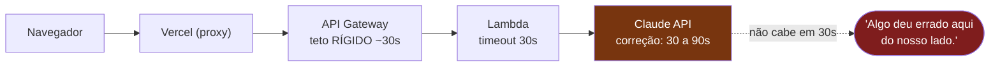
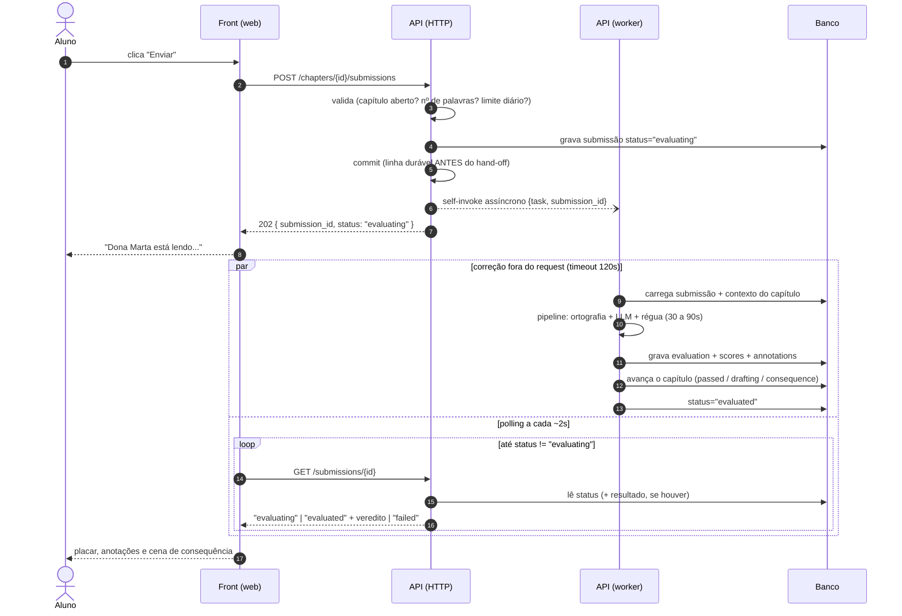
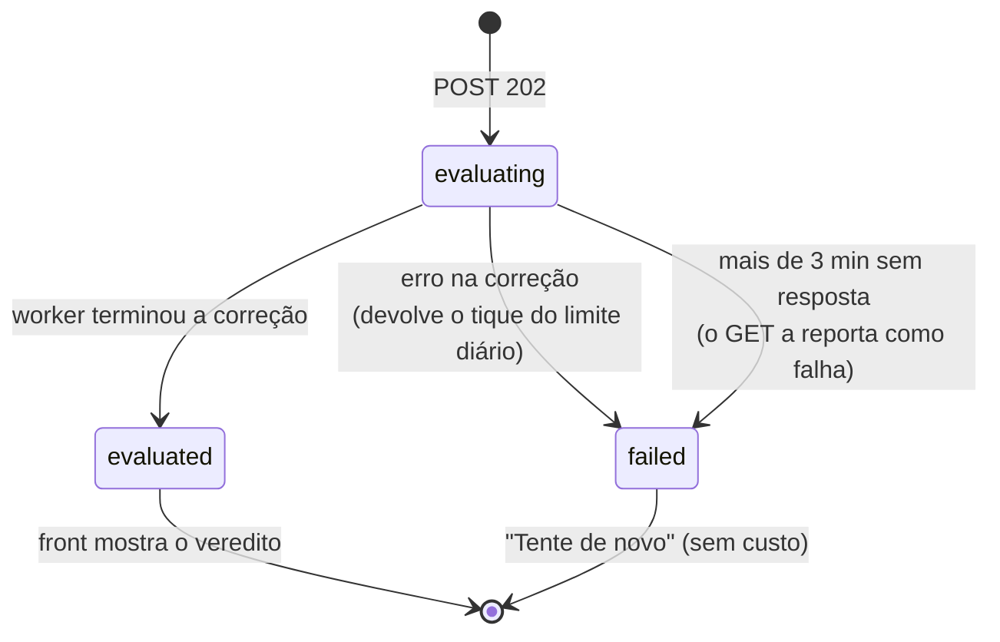
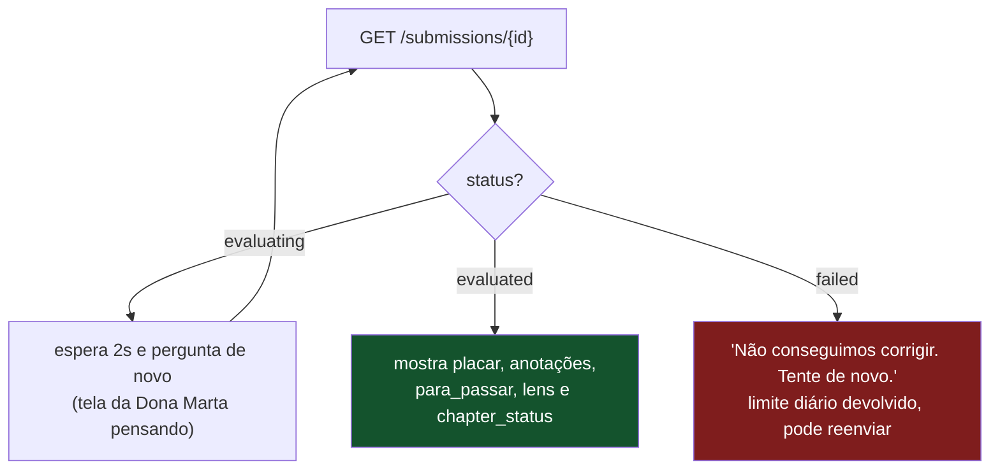
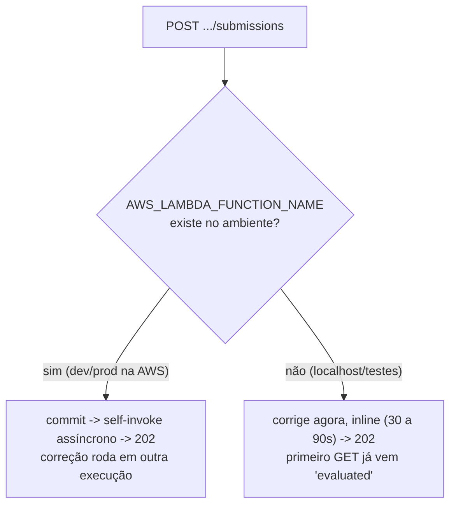

# Submissão assíncrona (card api#68)

## O problema de hoje

O `POST /chapters/{id}/submissions` roda a correção LLM inteira **dentro do request**.
A correção demora 30 a 90 segundos, e o caminho HTTP tem tetos de ~30s que não dá
para aumentar: subir o timeout da Lambda não adianta, o API Gateway corta em 30s
de qualquer jeito.

A resposta HTTP precisa voltar rápido, e a correção precisa acontecer em outro lugar.

## A sequência completa do novo fluxo

## O ciclo de vida de uma submissão

Nunca fica em "corrigindo" para sempre: se o worker morrer no meio, depois de
3 minutos o `GET` passa a responder `failed` e o aluno pode reenviar.

## O que o front faz com cada resposta do polling

## E no meu computador (dev local)?

Sem AWS, o dispatcher é inline: o mesmo processo corrige na hora, dentro do
próprio request, como hoje. O contrato HTTP não muda (202 + polling), só que o
primeiro `GET` já encontra o resultado pronto. O front tem UM comportamento só.

## O que muda em cada lugar

| Peça | Mudança |
|---|---|
| Banco | coluna `status` em `submissions` (`evaluating` / `evaluated` / `failed`) |
| `POST .../submissions` | não corrige mais; grava pendente e responde 202 |
| `GET /submissions/{id}` | novo endpoint de polling, escopado por usuário |
| Worker | novo entrypoint: a correção que antes vivia dentro do POST |
| Terraform | timeout 30s para 120s e permissão da Lambda invocar a si mesma |
| Front (web) | envia, mostra "lendo...", faz polling, trata `failed` |

## Regras que o assíncrono obriga a criar

1. **Capítulo aprovado nunca regride**: com duas submissões em voo, uma
   aprovação seguida de uma reprovação atrasada não pode devolver o capítulo
   para `drafting`. `passed` é estado final.
2. **Retry idempotente**: se a AWS reentregar o evento, um worker que encontra
   a submissão já `evaluated` não faz nada.
3. **Falha devolve o limite diário**: o tique das 3 correções/dia só é
   consumido por correção que aconteceu.
